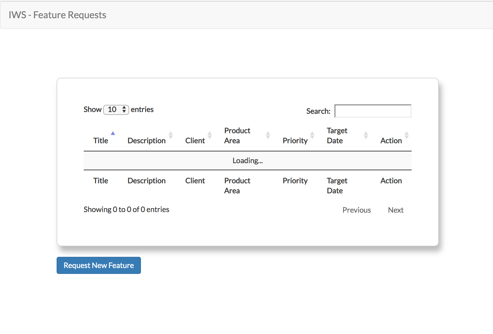

# Feature Request App

This repository houses code for a simple feature request api built for IWS employees to create feature requests. These feature requests have:
* Title
* Description
* Priority
* Target Date
* Client
* Product Aread

### Project Setup

#### Prerequisites
* [Docker](https://docs.docker.com/)
* [Docker Compose](https://docs.docker.com/compose/)

#### Clone Application
* Clone project: `git clone https://github.com/DanCarl857/feature-request-app.git` or you could just download it.

#### Run API
* `cd feature-request-app`
* `cd api`
* `python -m venv flask`
* `. flask/bin/activate`
* `pip install -r requirements.txt`
* `python run.py` or `export FLASK_APP=app` and then `flask run`

#### Run Web Client
* From the root folder(feature-request-app), run `cd web-client`
* `npm install`
* `npm run start`
* Access the application in your browser at [http://localhost:8000/]()

#### Run Tests
* From the root folder(feature-request-app), run `cd api`
* Run `pytest`

### Deploy
You should have Docker and Docker componse installed for this to work.

* Clone the project: * Clone project: `git clone https://github.com/DanCarl857/feature-request-app.git` or you could just download it.
* Run `cd feature-request-app`
* Run `docker-compose-up`
* The web client can then be found at [http://0.0.0.0:8080]()
* The api is available at [http://0.0.0.0:5000/api/v1]()

#### API Documentation

*Base URL*: [http://{HOST}:{PORT}/api/v1]()

| resource      | description                       |
|:--------------|:----------------------------------|
| `GET` - `/features`      | returns a list of all feature requests |
| `GET` - `/features/:number`    | returns a feature request with ID=`number` |
| `POST` - `/features` | Creates a feature request with payload |
| `PUT` - `/features` | Updates feature request using payload provided |
| `DELETE` - `/features/:number` | Deletes feature request with ID=`number` |

### Demo
A demo of the project can be found: [here]()

### Technology Stack
The technologies used in this project involve but are not limited to:
* [Flask](http://flask.pocoo.org/)
* [jQuery](https://jquery.com/)
* [SQLite](https://www.sqlite.org/index.html)
* [SQLAlchemy](https://www.sqlalchemy.org/)
* [Bootstrap]()
* [Docker](https://docs.docker.com/)
* Heroku(_for deployment_)

### Contributors
* [Kouetchua 'Daniel' Carlson](https://github.com/DanCarl857)

### License
This project is licensed under the MIT License - checkout [LICENSE.md](https://github.com/DanCarl857/feature-request-app/blob/master/LICENSE) for more details.